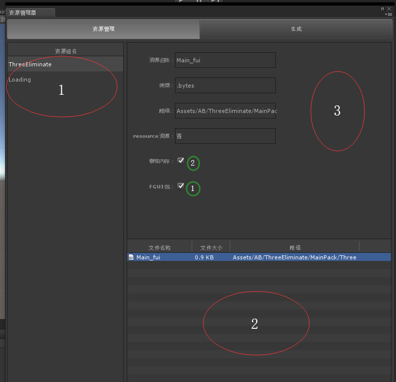
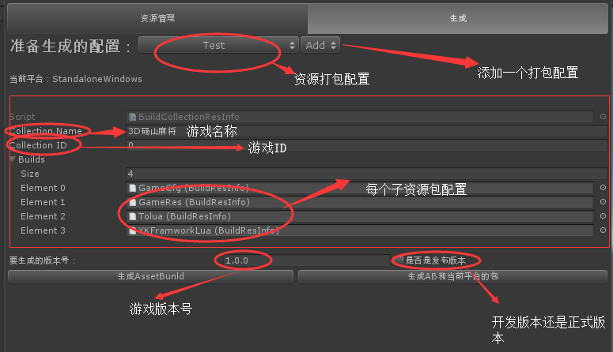

#YKFramework简介
[TOC]

##Project 目录说明

*  Assets
	*  AB `需要打包成ab的文件(每个文件夹被打包成一个ab)`
	*  Plugins `插件文件夹`
	*  Resources `资源文件`
	*  Source `ToLua 生成的代码文件夹`
	*  Scenes  `场景文件夹`
	*  StreamingAssets `流文件夹，ab会生成到这` 
	*  ToLua `tolua源码`
	*  YKFramwork   `框架文件夹`
		*   Editor `框架编辑文件夹`
		*  Resources `框架默认配置资源存放文件夹`
		*  Script `框架脚本文件夹`
* FGUIProject `案例当中的fairygui工程`
* Lua `LUA源码`
	* ToLua `tolua的lua源码`
	* YKFramwork `框架部分lua源码`
	* LuaAPI `用于idea提示用的源码`

* Release `发布会自动生成到的文件夹`
* Assembly-CSharp.zip `用于idea提示用的源码`
* LuaApi.zip `用于idea提示用的源码`
* mscorlib.zip `用于idea提示用的源码`
* UnityEngine `用于idea提示用的源码`

## 特殊文件说明

* Assets/AB/gamecfg/defres.json   `配置的加载资源以及资源组的信息`
* Assets/YKFramwork/Resources/gamecfg.asset `框架的配置信息`

## 自定义菜单栏说明
###Tools 自定义的工具
* SetExternalEditorPath `设置外部Lua编辑路径暂时只支持IDEA`
* SetLuaProjectRoot `设置lua工程的目录文件夹`
* 资源管理器 `可视化编辑资源加载以及释放的工具,同时生成个平台的ab包和发布`

##资源管理器工具特殊说明

### 资管管理

>界面图

上图红色框中内容解释
#### 1. 资源组 
>资源组可以添加删除和修改
>资源组这个区域的空白处点击右键能添加一个资源组
>资源组上点击右键可以修改和删除这个资源组，当然你也可以用F2或者用delete

####2. 资源组里面包含的资源
>可以把一个`Asset/AB`文件夹下的文件拖入这个东西的空白区域，就能添加到这个资源组，首先需要选中资源组

####3.资源信息
>资源信息大部分为预览信息，只有图中绿色部分圈中的地方为可编辑的
>此处
>1.若勾选常驻内存则不会被释放，反之会在切换场景的时候被释放
>2.如果这个资源是FGUI的包资源则勾选，一般FGUI3.0版本的资源工具能自动识别
>勾选后会在加载这个资源的时候自动添加到FGUI的包里面

### 生成

>配置文件会被存放在 -> `Asset/YKFramwork/Editor/BuildGameCfg` 文件夹下
>这一块比较复杂暂时这样说明下
>后期再专门补充文档

## 如何快速入门
###需要具备的知识
* 1.熟练使用C#
* 2.熟悉Tolua (当然你也可以剥离掉lua部分纯c#写也是完全支持的)
* 3.熟练使用Fairygui（当然其实这个框架不一定需要会，只是我的例子是Fairygui的，当然UI管理相关的都是Fairygui的）

如果上面的东西你都了解了的话那就简单了，打开工程里面的main场景
从GameCore 上面绑定的 Initialization脚本里面的Awake开始看

##最后
由于没有太多的时间和经历写文档所以只能暂时让各位动手能力强的一起完善
如果在这个过程当中有发现任何BUG和有任何意见都可以提issues
也可以加入QQ群：[931217607](https://jq.qq.com/?_wv=1027&k=5kT8aGe)